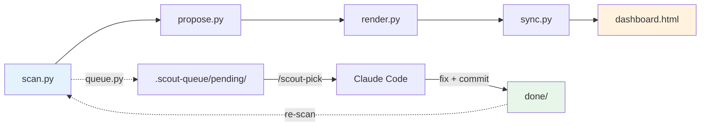

# Scout


[](https://github.com/Alpha-Oi/scout/actions/workflows/verify.yml)
[](https://www.python.org/downloads/)
[](https://opensource.org/licenses/MIT)
[](https://github.com/Alpha-Oi/scout/commits/main)

**Read-only project scanner with a dashboard.**  
14 detectors. Bugs, vulnerabilities, dead code, style.  
Finds, proposes, never edits. Works in Claude Code, Cursor, Codex, or plain CLI.

```
scout: 23 findings -> reports/2026-09-19-gptmemoryengine
  high     5     <- real bugs
  medium   7
  low      11
```

Then 5 tasks queued, fixed via `/scout-pick`, re-scan shows **6 findings, high 0**.

---

## Installation

### As a skill (Claude Code, Cursor, Codex)

    npx skills add Alpha-Oi/scout

One command. Installs Scout into .claude/skills/scout/.
After that in any project: /scout <path-to-project>

### As a CLI

    git clone https://github.com/Alpha-Oi/scout.git
    cd scout
    python -m pip install pytest pip-audit bandit ruff mypy vulture radon interrogate detect-secrets semgrep uv
    python -m uv tool install pyscn

Missing tools are skipped, not faked. Scout works with whatever is installed.

---
## Quick start

```sh
git clone https://github.com/Alpha-Oi/scout.git
cd scout

python tools/scan.py <path-to-project> --out ./reports
python tools/propose.py ./reports/<run-dir>
python tools/render.py ./reports/<run-dir>
python tools/sync.py ./reports

# open reports/dashboard.html
```

Or, in Claude Code / Cursor / Codex:

```
/scout <path-to-project>
```

---

## How it works



- **Read-only core.** `scan.py` never writes inside the scanned project.
- **Opt-in fixer.** `.scout-queue/` + `/scout-pick` is a separate, safe workflow.
- **Deterministic diff.** Same finding keeps same `fingerprint` between runs.

---

## Detectors

| Detector | Category | What it finds | Requires |
|---|---|---|---|
| `pytest-failed` | bug | Failing tests | pytest |
| `pip-audit` | vuln | Known CVEs in dependencies | pip-audit |
| `pip-outdated` | improvement | Outdated deps (no CVE) | pip |
| `bandit` | vuln | eval, subprocess shell, weak crypto | bandit |
| `ruff` | bug / improvement | Undefined names, unused imports, style | ruff |
| `mypy` | bug | Type errors - None, attributes, arguments | mypy |
| `vulture` | improvement | Dead code - unused functions, variables | vulture |
| `radon` | improvement | Cyclomatic complexity > 10 | radon |
| `interrogate` | improvement | Missing docstrings | interrogate |
| `pyscn` | improvement | Code clones | uv |
| `semgrep` | vuln | SAST with curated rules | semgrep |
| `detect-secrets` | vuln | Entropy-based secret detection | detect-secrets |
| `todo-fixme` | incomplete | TODO / FIXME / XXX / HACK | (built-in) |
| `secrets` | vuln | Regex API keys, tokens, passwords | (built-in) |

Missing tools are skipped, not faked. Each detector is independent.

---

## Dashboard

Single self-contained HTML. Opens as file, over HTTP, from a panel. No server needed.

**Three views:**

- **By findings** - flat list, sorted by severity
- **By code** - grouped by rule code (`I001 x450` collapses 450 cards into 1)
- **Diff** - new / fixed / moved / unchanged vs previous run

**Per finding:**

- Copy task - markdown prompt for Claude Code
- Open in VS Code - `vscode://file/<abs-path>:<line>`
- Evidence, proposal, risk, effort

**Extras:**

- Live search across file, title, detector, evidence
- `/` focus search, `Esc` clear
- SARIF export -> GitHub Code Scanning
- Markdown export -> issue / PR / Slack
- Collapsible groups (persisted in localStorage)

---

## Case study - GPTMemoryEngine

Real project (~200 lines of Python, RAG-memory engine).

| Stage | critical | high | medium | low | **Total** |
|---|---|---|---|---|---|
| Initial scan | 0 | **5** | 7 | 11 | **23** |
| After fixes | 0 | **0** | 2 | 4 | **6** |

**What got fixed:**

- `PyPDF2` CVE (PYSEC-2026-1835) -> migration to `pypdf` (one-line import change)
- 7 mypy type errors -> 0 (open mode, bytes/str, annotations)
- 4 ruff issues -> 0 (SIM115 x2, F841, BLE001)
- 3 import-sort I001 -> 0

**Method:** scan -> queue -> fix (manual or `/scout-pick`) -> re-scan -> diff.  
**Result:** ruff and mypy clean, no CVEs, no high findings.

---

## Self-scan

Scout runs its own detectors on itself.

```
scout: 59 findings -> scout-reports/2026-09-19-scout-13
  critical 0
  high     0
  medium   15
  low      44
```

No critical or high findings. Ruff and mypy both clean. Max complexity in `scan.py`: 13 (was 32 before refactor).

---

## Queue + /scout-pick

Scout can write every finding to `.scout-queue/pending/` as a task file. A Fixer (Claude Code, Cursor, or manual) picks one, fixes, verifies, commits.

```sh
# Generate tasks from a run
python tools/queue.py <run-dir> --severity high --detector ruff
```

In Claude Code, in the target project:

```
/scout-pick
```

Takes the oldest task, shows it, waits for confirmation (unless `--yes`), applies minimal fix, runs verify commands, commits. If verify fails - `git restore` and move to `rejected/`.

**Hard rules:** one task per invocation, only touched files, no `git push`.

---

## LLM proposals (optional)

Off by default. Enable with `--llm`. Provider auto-detected:

| Provider | Trigger | Speed |
|---|---|---|
| Anthropic | `ANTHROPIC_API_KEY` set | fast, paid |
| OpenAI | `OPENAI_API_KEY` set | fast, paid |
| Ollama | `127.0.0.1:11434` answers | local, free |

```sh
python tools/propose.py <run-dir> --llm --llm-max 20
```

Responses cached in `.scout-llm-cache.json` keyed by fingerprint.

---

## Configuration - .scoutrc

Optional. Drop in project root.

```json
{
  "skip_detectors": ["pyscn", "semgrep"],
  "severity_rules": {
    "todo-fixme": "low",
    "interrogate": "low"
  },
  "max_findings": 500,
  "max_findings_per_detector": {
    "pip-outdated": 20,
    "ruff": 200
  },
  "bandit_skip": ["B105", "B404", "B603", "B607", "B311"]
}
```

See `.scoutrc.example` for defaults.

---

## CLI reference

| Command | Purpose |
|---|---|
| `python tools/scan.py <path> --out <dir>` | Run detectors, write findings.json |
| `python tools/propose.py <run>` | Write proposals.json (rules or `--llm`) |
| `python tools/render.py <run>` | Build state.js from findings + proposals + diff |
| `python tools/sync.py <dir>` | Inline state into dashboard.html |
| `python tools/diff.py <old> <new>` | Compare two runs -> diff.json |
| `python tools/queue.py <run>` | Write tasks to .scout-queue/pending/ |

**Flags:** `--quick` (skip slow detectors), `--llm`, `--max-findings N`, `--dry`.

---

## Detector contract

Every finding is JSON:

```json
{
  "id": "sha1:abc123",
  "category": "bug|vuln|incomplete|improvement",
  "severity": "critical|high|medium|low",
  "title": "short line",
  "file": "relative/path",
  "line": 42,
  "evidence": "raw detector output",
  "detector": "name",
  "detected_at": "ISO-8601",
  "fingerprint": "stable across runs"
}
```

`fingerprint` = `detector:file:line:title`. Same issue keeps same fingerprint between runs, which is what makes diff possible.

---

## Rules

1. **Read-only.** No file inside the scanned project is written by scan.py.
2. **Evidence or silence.** Every finding carries file, line, and detector output.
3. **One proposal per finding.** Concrete action, not "improve security".
4. **Deterministic by default.** Same findings -> same proposals. LLM is opt-in.
5. **Missing tool, missing detector.** Nothing is faked.

---

## Layout

```
scout/
  SKILL.md              skill entrypoint (phases, rules)
  phases/               per-phase rules, read one at a time
  tools/                runtime - scan, propose, render, sync, diff, queue
  scripts/              verify-skill.py, build-adapters.py
  AGENTS.md             adapter for Codex
  CLAUDE.md             adapter for Claude Code
  .cursor/rules/        adapter for Cursor
  .github/workflows/    CI: verify-skill on every push
  .scoutrc.example      config template
  LICENSE               MIT
```

---

## License

MIT. See [LICENSE](LICENSE).